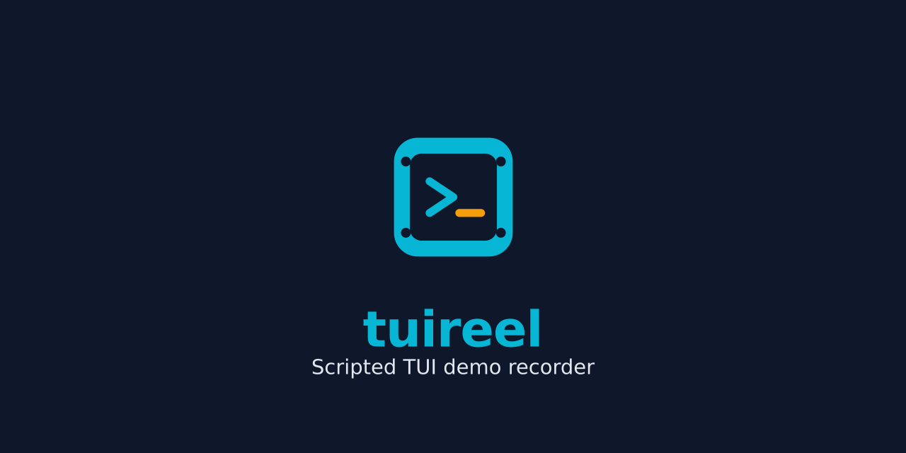

<p align="center">
  <picture>
    <source media="(prefers-color-scheme: dark)" srcset="assets/branding/logo-dark.svg">
    <source media="(prefers-color-scheme: light)" srcset="assets/branding/logo-light.svg">
    
  </picture>
</p>

<p align="center">
  
</p>

<p align="center">
  Scripted TUI demo recorder — produce polished terminal demo videos from declarative configs.
</p>

<p align="center">
  <a href="https://www.npmjs.com/package/tuireel"></a>
  <a href="https://github.com/Microck/tuireel/actions/workflows/ci.yml"></a>
  <a href="./LICENSE"></a>
</p>

---

Tuireel executes scripted terminal interactions in a virtual PTY, captures frames, and renders polished videos (MP4, WebM, GIF) with optional overlays and sound effects — no manual recording or editing required.

[Documentation](https://tuireel.micr.dev) · [GitHub](https://github.com/Microck/tuireel)

## Quick Start

```bash
npm install -g tuireel   # or: npx tuireel / bunx tuireel
tuireel init              # scaffold a demo config
tuireel record            # record your first demo
```

The generated config is a JSONC file describing your demo steps:

```jsonc
{
  "output": "demo.mp4",
  "steps": [
    { "type": "type", "text": "echo 'Hello, world!'" },
    { "type": "press", "key": "Enter" },
    { "type": "pause", "duration": 1000 },
  ],
}
```

## Usage

### `tuireel init`

Scaffold a new demo config.

- `-o, --output <path>` — output file path (default: `.tuireel.jsonc`)
- `-f, --force` — overwrite existing config

### `tuireel record`

Record a demo from config.

- `--format <mp4|webm|gif>` — output format (default: mp4)
- `-w, --watch` — re-record on config change
- `--verbose` / `--debug` — increase log output

### `tuireel preview`

Preview a config without recording.

- `--verbose` / `--debug` — increase log output

### `tuireel composite`

Re-render overlays on an existing recording.

- `-c, --config <path>` — config path
- `--format <mp4|webm|gif>` — output format
- `--cursor-size <n>` — cursor size in pixels
- `--no-cursor` / `--no-hud` — disable overlays
- `--verbose` / `--debug` — increase log output

### `tuireel validate`

Validate a config file without recording.

### Step Types

| Type         | Key Fields             | Description                                 |
| ------------ | ---------------------- | ------------------------------------------- |
| `launch`     | `command`              | Start a terminal program                    |
| `type`       | `text`, `speed?`       | Type text into the terminal                 |
| `press`      | `key`                  | Send a key press (Enter, Tab, Ctrl+C, etc.) |
| `wait`       | `pattern`, `timeout?`  | Wait for text to appear in output           |
| `pause`      | `duration`             | Pause for a fixed duration (ms)             |
| `scroll`     | `direction`, `amount?` | Scroll the terminal view                    |
| `click`      | `pattern`              | Click on matching text                      |
| `screenshot` | `output`               | Take a screenshot                           |
| `resize`     | `cols`, `rows`         | Resize the terminal mid-recording           |
| `set-env`    | `key`, `value`         | Set an environment variable                 |

### Config Options

| Field           | Description                          |
| --------------- | ------------------------------------ |
| `output`        | Output file path                     |
| `format`        | Output format (`mp4`, `webm`, `gif`) |
| `theme`         | Terminal color theme                 |
| `steps`         | Array of step objects                |
| `fontSize`      | Terminal font size                   |
| `cols` / `rows` | Terminal dimensions                  |
| `sound`         | Sound effect configuration           |
| `cursor`        | Cursor overlay settings              |
| `hud`           | Keystroke HUD settings               |
| `videos`        | Multi-video configuration            |

> See the [full documentation](https://tuireel.micr.dev) for complete configuration reference.

## Development

### Prerequisites

- Node.js 18+
- pnpm 10+ (`corepack enable`)
- ffmpeg on PATH

### Setup

```bash
git clone https://github.com/Microck/tuireel.git
cd tuireel
pnpm install
pnpm build
```

## Packages

| Package                          | Description                                 |
| -------------------------------- | ------------------------------------------- |
| [`tuireel`](packages/cli)        | CLI interface                               |
| [`@tuireel/core`](packages/core) | Recording, compositing, and workflow engine |

## License

[Apache 2.0](./LICENSE)
